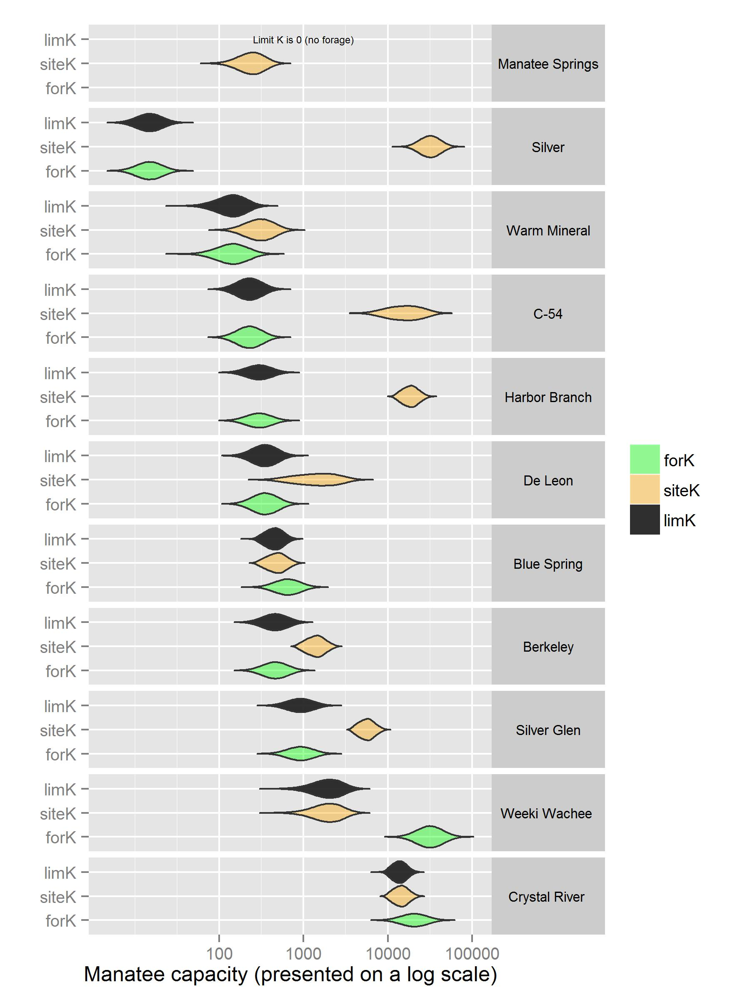

# R script and data for Manatee carrying capacity analysis

The data and script presented herein are in support of a soon to be published paper titled *Carrying Capacity Assessment Methodology Used to Evaluate Manatee Forage and Warm-water Sites in Florida* by *Jane Provancha, Cynthia Taylor, Manny Gimond, and Michael Wild*

The project consists of two folders: `./R_script` and `./GIS`.

## R script
The `R_script` folder houses the R script used to estimate the carrying capacity of Manatees at eleven warm water sites in Florida. The folder consists of two files: the script (`ManateeK.R`) and the input data file (`capacity.csv`). The R script can be run using the open source data analysis package [R](https://www.r-project.org/).

A `Sample/` folder houses sample output tables and figures one should produce when running this script.

A sample violin plot follows (Figure 2 in referenced text)

The plot was generated under R `version 3.2.2 (2015-08-14)` and packages `scales_0.3.0`, `ggplot2_1.0.1`, `dplyr_0.4.3`, `tidyr_0.3.1`, `triangle_0.8`

## GIS data
The `GIS` folder houses GIS data analysis results presented in the referenced paper.